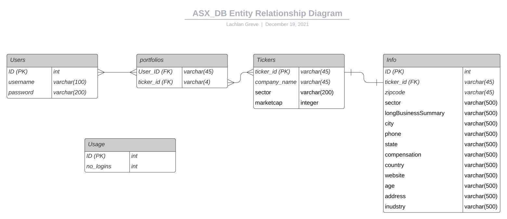

# T3A3_asx_app
A web application to view and follow financial data from ASX listed companies.

## Installation:

__Dependencies__
* Python 3
* PostgreSQL
* virtualenv
* pip

__CLONE REPO__:
```bash
 git clone https://github.com/l-j-g/T3A3_asx_app 
 ```

__CREATE VENV__:
```bash
# /T3A3_asx_app/
virtualenv venv
```

__ACTIVATE VENV__
```bash
# /T3A3_asx_app/
source venv/bin/activate
```

__INSTALL DEPENDENCIES__
```
# /T3A3_asx_app/
pip install -r requirements.txt
```

__CREATE DATABASE AND USER__
```SQL
psql postgres

>> CREATE DATABASE <db_name_here>;
>> CREATE USER <user_name_here> WITH PASSWORD '<password_here>';
>> GRANT ALL PRIVILEGES ON DATABASE <db_name_here> TO <user_name_here>;
>> \q
```

__SET ENVIRONMENT VARIABLES__

Easiest during development is to add a `.env` file to the `/T3A3_asx_app/` directory like so:

```bash
# /T3A3_asx_app/
DB_USER = # value from above
DB_PASS = # value from above
DB_NAME = # value from above
DB_DOMAIN = "localhost:5432"
SECRET_KEY = # dealer's choice - a long random string is most secure
```

__CREATE/MIGRATE TABLES USING TERMINAL COMMANDS__

Custom terminal commands have been provided to preform delete, create and seed tables used in the database.

Terminal commands for the app must be executed from the `/T3A3_asx_ap/` directory. Currently available commands are:

`flask db-custom drop` -> drops all tables

`flask db-custom create` -> creates all tables

`flask db-custom seed` -> seeds database with ticker data __note: running this command is essential for full functionality of the application__

`flask db-custom reset` -> drops, creates and then seeds the database

`flask db-custom export` -> writes all data contained in the database into a text file that contains a series of SQL commands that can be used to restore the database.

`flask db init` -> initializes the `/migrations/` folder

`flask db migrate -m "<migration note>"` -> creates a new migration

`flask db upgrade` -> applies migrations (optional - specify a target migration)

`flask db downgrade` -> un-applies migrations (optional, specify a target migration)

__RUN APP__ 
```bash
# /T3A3_asx_app
flask run
``` 
Using your web browser navigate to [http://127.0.0.1:5000/home](http://127.0.0.1:5000/home)


## Requirements:

- [flask](): Python web framework

- [postgresql](https://www.postgresql.org/docs/14/index.html): open source object-relational database management system

- [psycopg2](https://www.psycopg.org/docs/): postgreSQL adapter for Python.

- [jinja](https://jinja.palletsprojects.com/en/3.0.x/): HTML templating engine for Python

- [marshmallow](https://marshmallow.readthedocs.io/en/stable/): library for converting datatypes to and from Python objects.

## Purpose:

The purpose of this application is to demonstrate web application development with create, read, update, delete (CRUD) capabilities. This application includes a full stack development framework that provides a Data, Application and Presentation layer utilising python, flask and postgresql. It has been developed in completion of the requirements of Term 3 Assignment 3 as a part of the Code, Cloud and Cyber course at CoderAcademy.

The application allows users to view information about and follow data for companies that are publicly listed on the Australian Stock Exchange. Users are able to register persistent accounts on the site, add selected companies to their portfolio and view the portfolios of other users on the site. Furthermore, the application demonstrates functionality to preform data aggregation and validation in order to assist in data interpretation and prevent integrity errors.

### List of Pages and Functionality:

- **Home**: Landing page for the site, providing general information and directions. Tracks the number of users that have logged in.
- **Users Index**: Displays an index of all users that have registered on the site
- **User Profile**: The public facing profile of each user registered on the site, displaying information about the users account
- **User Account**: Allows users to change account settings
- **Register**: Facilitates registration of new users
- **Sign In**: Login and validation of existing users credentials
- **Tickers Index**: List of companies that are tracked by the database
- **Ticker Details**: View information about specific companies.

### Entity Relationship Diagram:



__Tables__:

- Users: Stores data relating to users accounts incl. ID, username and password.
- Tickers: Stores data about companies listed on the ASX
- Portfolios: A linkage table for the many-many relationship between Users and Tickers that is used to identify what tickers users are following.
- Info: Additional information about listed companies. One to one relationship to the ticker table of which the information relates to.
- Usage: Used to track use of the website, identifies the number of times users have logged into the site.

## Validation of Fields

This application utilises the `marshmallow` packages to preform validation of input data. Further field integrity is provided by SQL domain, entity and referential constraints that have been implemented at schemas through the `SQLAlchemy` package.

### Passwords

SQL constraints: string, unique, not null, length < 200.

Passwords are validated to ensure that they conform to the following policy:

- at least 6 characters, less then 200 characters.
- 1 upper case letter
- 1 lower case letter
- 1 digit

### Usernames

SQL constraints: string, not null, length < 200.

Usernames are validated to ensure that they contain at least 6 characters.

## Features

# TODO

## Security

To provide security of user credentials no passwords will be stored as plaintext in the database. Passwords will instead be stored as a one-way hash which is irreversible to plaintext. With the given hash an attacker would not be able to guess the plain text password, brute forcing is technically possible but the probability of cracking hash within a reasonable time period is extremely low. In case the password database was to be compromised, each password hash will be generated with a different salt to prevent rainbow table type attacks.

Authentication features from the Flask-login package will generate cookies and handle user sessions that can then be used to restrict user access only to features they are authorised for. For example - The only user that can update a users account settings (like their username or the companies that are in their portfolio) is the owner of that account.

Protection against SQL injection attacks is provided by the SQLAlchemy ORM. SQLAlchemy sends queries written in Python, retrieves data from the postgresql database and converts the retrieved queries back into native Python objects. By avoiding the exposure of raw SQL to the application layer, the ability to preform SQL injection attacks is largely mitigated.

Any special characters (such as semicolons or apostrophes) sent in query is automatically quoted by the SQLEngine object. This also means that unless you deliberately bypass SQLAlchemy's quoting mechanisms, SQL-injection attacks are basically impossible.

In one instance of the application the potential for SQL-injection is possible through query parameters that are exposed in the URL, as below:

```python
    @tickers.route("/tickers/orderway=<string:order>&groupby=<string:group>", methods=["GET"])
    #...
        "tickers": tickers_schema.dump(Tickers.query.order_by(getattr(getattr(Tickers,group),order)()).all()),
```

However, because this query is only preforming data sorting and grouping and the `Ticker` table data is non-sensitive, and `dump_only` (data can only be read, not entered) the potential for any malicious action through this query is low.

### Professional, Ethical and Legal Obligations

__Professional__

The time frame to deliver this project was two weeks (between 5th October 2021 - 19th October 2021.) The project delivers a framework of an application that could easily be scaled up to add many companies and features.

To the best of my ability I have delivered an application that meets the required brief, runs with minimal errors and protects the personal information of users.

__Ethical__

An ethical obligation of this website is to protect users personal information such as their passwords - if this password was not properly secured a malicious actor could use these credentials to potentially access.

The information provided on this site will also, to the best of its ability provide factually correct and accurate information. To address this, the ticker information that is displayed on this site has been sourced from Yahoo Finance services, utilising the yahoo_fin Python package. The script to prepare this data for import into this application is available here: https://github.com/l-j-g/asxData

__Legal__

In Australia it is a requirement under the Financial Services Reform Act 2001 to be authorised under an Australian financial services (AFS) licence to provide financial product advice. Therefore it is a legal obligation to state that the information on this website is for general information only.

The website not be taken as constituting professional advice from the website owner. I am not not liable for any loss caused, whether due to negligence or otherwise arising from the use of, or reliance on, the information provided directly or indirectly, by use of this website.


